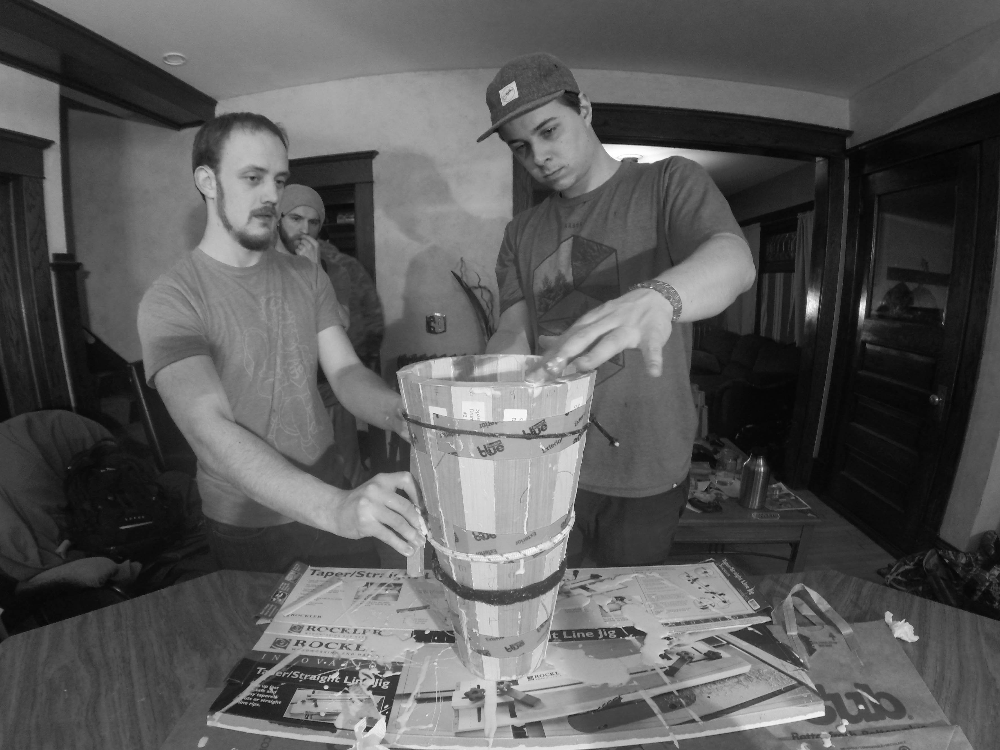
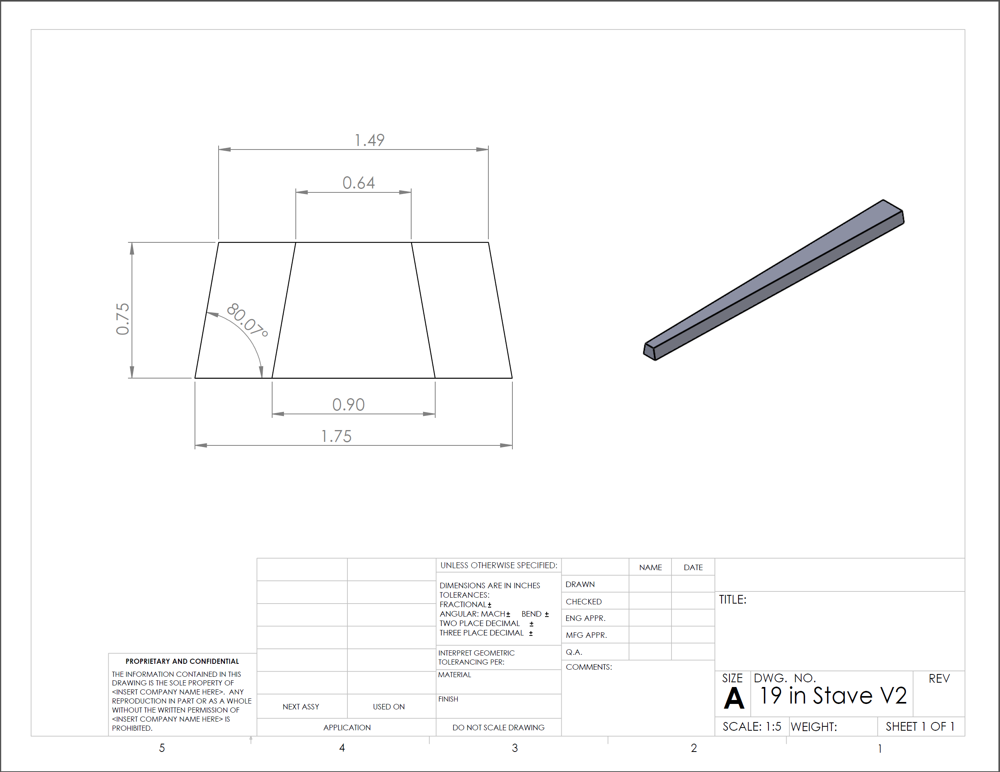
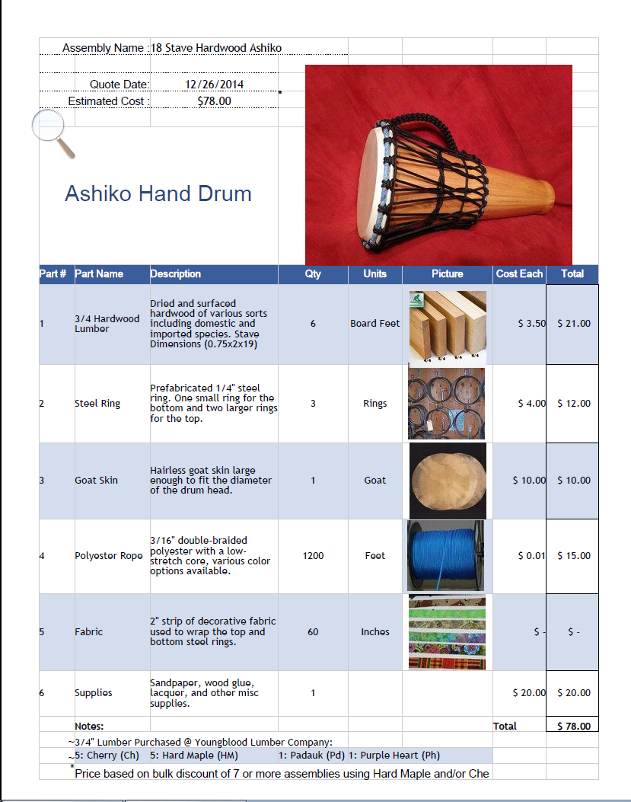

# Ashiko Drum-Building Workshop

> *In January 2015, I designed and led an 8-person workshop at a Twin Cities makerspace where we built 16 traditional African ashiko drums end-to-end — from sourcing raw hardwood lumber to lacing on the goatskin head.*



## What this is

An archive of the engineering and process documentation behind a workshop I designed and led at a Minneapolis makerspace in January 2015. Eight friends — most of whom had never used a table saw or a wood lathe — built sixteen full-scale ashiko hand drums together over several weeks.

This repository contains the things we needed to make that work: bills of material, CAD geometry, custom lathe-fixture drawings, the table-saw sled jig used for compound stave cuts, per-builder customization, and photos from the build. It is part build log, part teaching artifact, part portfolio piece.

## Background

The ashiko is a West African hand drum of Yoruba origin, traditionally carved or staved hardwood with a goatskin head — its sound sits between the deeper tone of a djembe and the brighter tone of a conga.

A few years before this workshop, I worked at **Morgan Drums**, a small St. Paul, MN family company building African hand drums — djembes, ashikos, bongos, and frame drums. That is where I learned the craft side: how to read a stave, how to read a goatskin, how a drum's tone changes between the lathe pass and the rope pull.

By late 2014 I was a member at a Twin Cities makerspace and convinced seven friends to spend a winter building drums with me. None of them were drum makers. The fun of it — and the engineering challenge — was designing a process robust enough that a bakery chef, a software salesman, and a yoga teacher could each produce a tuneable, beautiful drum on their first attempt.

## The process

The build runs through eight stages. Each stage has its own engineering choice tucked inside it.

| Stage | What we did | Engineering note |
|---|---|---|
| 1. Lumber sourcing | Bought board feet of cherry, hard maple, padauk, and purpleheart at Youngblood Lumber | Bulk pricing changed the BOM dramatically — see "BOM evolution" below |
| 2. Stave draft | "Drafted" the lumber across builders so each drum had a balanced wood mix | See `BOM/Stave-Draft-Rounds-1-7.pdf` |
| 3. Compound stave cuts | Cut 18 staves per drum on a Bosch 4100 table saw with a custom sled | Sled jig CAD in `CAD/table-saw-sled/` |
| 4. Glue-up | Two-half clamping fixture, Titebond III, ratchet straps | High-res photos in `/images/05*` |
| 5. Lathe turning | Custom keyed steel drive shaft + collar flange + 5/8" arbor → 60° cone adapter | All in `CAD/lathe-fixture/` |
| 6. Sanding & finishing | Progressive grits, then lacquer | — |
| 7. Ropework | 3/16" double-braided polyester rope, ~100 ft per drum | — |
| 8. Goatskin head | One large hairless goatskin per drum, soaked, mounted, tuned | — |

## Engineering artifacts

### Stave geometry

Three iterations of the 19-inch stave part lived in CAD before the workshop started. `19in-Stave-V3.SLDPRT` is the version we cut against. The V3 drawing (`19in-Stave-V3.SLDDRW`) is the one I'd hand a builder.



### The table-saw sled jig

The single most engineering-heavy artifact in the project. Cutting 18 staves each with two compound miter cuts, two chop saw cuts, repeatably, ~72 cuts per drum × 16 drums, on a portable contractor saw, with eight different operators of varying experience — this is what made the workshop teachable. The sled assembly broke down into four parts:

- `Base-Board.SLDPRT` — the sled deck
- `Rib.SLDPRT` — the angled fence
- `Dowel.SLDPRT` and `Dowel-Holder.SLDPRT` — index pins for repeatable stave alignment

The reference document we built from is in `reference/Table-Saw-Sled-Construction-Reference.pdf`, with the table-saw owner's manual alongside in `reference/Bosch-4100-Table-Saw-Manual.pdf`.

### The lathe fixture

To turn a glued-up 18-stave drum body on a wood lathe without it walking, you need a custom drive arrangement that grips internally and transfers torque cleanly. The lathe fixture in `CAD/lathe-fixture/` includes:

- A 1-inch keyed steel drive shaft — two revisions, V1 → V2
- A 1-inch collar flange to interface the shaft with the lathe headstock
- A 5/8" arbor → 60° cone adapter (custom turned, drawing exported as PDF)
- The full `Ashiko-Turning-Assembly.SLDASM` showing how it all stacks up

McMaster-Carr referenced parts (for the bearings, fasteners, and bushings used in the fixture) are in `CAD/components/` keyed by their McMaster part number for reproducibility.

### Drum body iteration

The drum body went through six numbered revisions across roughly a year, from `Ashiko-REV010715.SLDPRT` (January 7, 2015 — first cut) through `Ashiko-REV012316.SLDPRT` (January 23, 2016 — post-workshop refinements after listening to all 16 finished drums). Iteration log lives in the file timestamps and the V1/V2/V3 forks in between.

### BOM evolution

The bill of materials went through two formal revisions during planning. The headline change: **estimated cost dropped from $135 to $78 per drum** between V1 and V2, primarily because we negotiated bulk pricing on hardwood lumber by buying for all eight builders at once, then "drafted" the boards across drums to keep each drum's wood mix interesting.



The full BOM PDFs are in `/BOM/`, including the lumber-share spreadsheet that tracked how much cherry/maple/padauk/purpleheart each builder ended up with.

### Per-builder drawings

Each builder got a personalized stave-cut drawing showing exactly which boards their staves came from and what order to cut them. These are in `/drawings/` (`Drawings-Tony-Dallas-Joe.pdf`, `Drawings-Max-Tyler-Dan.pdf`, `Drawings-Mike-Spare.pdf`, plus spare-drum drawings).

We also printed Avery 5160 labels for every stave so they didn't get mixed up between cut and glue-up — the label sheet template is `drawings/Stave-Labels-Avery-5160.pdf`.

## What I learned from running this

A few things that translate directly to the engineering work I do now:

- **Process design beats individual skill.** Even the most novice builder produced a drum indistinguishable from the most experienced builder's. That happened because the jigs and fixtures absorbed the variance, not because everyone became equally skilled. Same principle as Design for Manufacturability — the process should make the tolerance, not the operator.
- **Documentation is leverage.** The per-builder cut drawings, the labeled staves, the BOM revisions — without those, eight people working in parallel would have produced sixteen subtly different drums. With them, we produced sixteen drums to the same spec and learned far more about why drums sound how they do.
- **Iteration is cheap on the CAD side, expensive on the lumber side.** Six drum body revisions cost me a few weekends in SolidWorks. Cutting the wrong stave angle would have cost a board-foot of cherry per mistake. Front-load the iteration where it's free.

## Builders

Tony · Dallas · Dan E. · Dan P. · Joe · Max · Mike · Tyler

## License

Released under [CC-BY 4.0](LICENSE) — use freely with attribution. The drum design itself draws on traditional ashiko geometry; the CAD, drawings, photos, and process documentation in this repository are my work, free to reuse and adapt with credit.

## Repository structure

```
ashiko-drum-workshop/
├── README.md                  ← you are here
├── LICENSE                    ← CC-BY 4.0
├── .gitignore
├── BOM/                       ← bills of material, lumber draft
├── CAD/
│   ├── stave/                 ← 18-stave geometry, V1 → V3
│   ├── drum-body/             ← 6 numbered revisions of the assembled body
│   ├── lathe-fixture/         ← drive shaft, collar, cone adapter, full assembly
│   ├── table-saw-sled/        ← compound-cut sled jig (4 parts)
│   └── components/            ← McMaster-Carr referenced parts
├── drawings/                  ← per-builder stave cut PDFs + Avery 5160 labels
├── images/                    ← curated build photos + figures
└── reference/                 ← Bosch 4100 saw manual, sled construction reference
```
